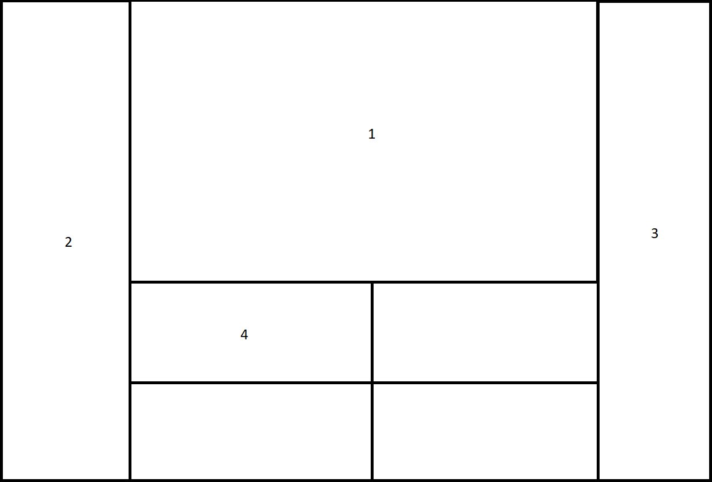

# Требования к проекту

## Введение

### 1.1 Назначение

В этом документе описаны функциональные и нефункциональные требования к приложению. Документ предназначается команде разработчиков и команде тестировщиков, которые будут реализовывать и проверять работу данного приложения. Названием приложения было выбрано "Online Stadium"

### 1.2 Бизнес требования

#### 1.2.1 Исходные данные

На данный момент одним из самых популярных и в то же время активно набирающих свою аудиторию видом спорта является футбол. Данный вид спорта крайне популярен практически в любой стране мира. Футбольные фанаты приносят огромный заработок клубам от посещения матчей и просмотра используя телесервисы. На фоне прошедшей пандемии огромную популярность приобрели различные сервисы, предоставляющие просмотр матчей в режиме онлайн. По прошествию запрета посещения матчей сервисы все еще остаются популярными и имеют немалый доход.

#### 1.2.2 Возможности бизнеса

Чтобы придать просмотру матчей новую специфику, а также захватить аудиторию которая по различным причинам не имеет возможности просматривать матчи, или делать это со знакомыми есть возможномть создать сервис, позволяющий просматривать матчи в так называемых "комнатах", в которых могут собираться как случайные зрители, так и различные компании. Данная возможность исключит живой контакт в случае обострения пандемии и предоставит новые ощущения для многих фанатов.

#### 1.2.3 Границы проекта

"Online Stadium" будет организовывать работу комнат для просмотра, предоставляя различные категории для поиска. Также будет предоставлен шорт-лист текущих матчей, расписания, краткая и полная статистика команд и чемпионатов. Программа будет условно бесплатной. Регистрация является обязательной.

Бесплатная версия программы будет содержать доступ к рандомно сгенерированным комнатам, возможность присоединиться к уже созанной комнате, базовые возможности администрирования комнат, доступ к шорт-листу матчей, доступ к ленте новостей. Также будет ограниченная возможность самому создавать свои комнаты.

Платные расширения будут включать полное взаимодействие с созданными комнатами, доступ ко всему перечню статистических данных, возможность предугадывать исходы матчей (в случае правильного предсказания исхода предусмотрена награда), полное отключение случайной рекламы в приложении.

### 1.3 Аналоги

В качестве статистического сервиса в СНГ регионе популярным аналогом является [sports.ru](https://www.sports.ru/), в европейском регионе [The Athletic](https://theathletic.com/). Аналогом в коммуникативной части можно назвать чат-рулетку (например [Omegle](http://www.omegle.com/)) или стриминговую платформу (например [Twitch](https://www.twitch.tv/)).

---

## 2 Требования пользователя

### 2.1 Интерфейс пользователя

1. Окно для просмотра матча в текущей комнате

2. Меню. Используется для выхода (перехода к следующей) из комнаты, просмотра статистики текущих матчей, возврат в главное меню.

3. Меню настройки. Доступна только администратору (создателю) комнаты, содержит параметры комнаты и функции для ее настройки и администрирования.

4. Пользователи в текущей комнате. При наличии у пользователей камеры, их изображении в реальном времени.

### 2.2 Характеристики пользователей

#### 2.2.1 Классификация пользователей

**Не зарегистрированные** пользователи - пользователи, не прошедшие регистрацию в приложении, не имеют доступ к основным функциям прилоения.

**Зарегистрированные** пользователи - пользователи, прошедшие регистрацию в приложении, имеют доступ ко всем базовым и бесплатным функциям приложения.

**Зарегистрированные и получившие доступ к платным функциям** пользователи - пользователи, прошедшие регистрацию в приложении, оплатившие доступ к одной (или нескольким) платным функциям, имеют доступ ко всем базовым и бесплатным функциям приложения, доступ к приобретенным функциям.

#### 2.2.2 Целевая аудитория

Футбольные фанаты

### 2.3 Предложения и зависимости

1. Приложения должно иметь доступ к базе данных, расположенной в облачном хранилище (или на сервере).

2. Приложение должно иметь возможность использования камеры устройства.

3. Приложение должно иметь функцию обновления статистических данных.

4. Приложение должно иметь функцию коммуникации между пользователями.

5. Поддержка доступа к приложению только для ОС Windows.

## 3 Cистемные требования

### 3.1 Функциональные требования

#### 3.2 Приложение от лица пользователя

При открытие приложения пользователь получает доступ к меню и окну своего профиля.

В меню пользователь может выбрать между поиском комнат и созданием своей, просмотром шорт-листа матчей, новостей, статистики.

В окне профиля пользователь может задать персональные данные, видные другим пользователям, а также приобрести платные функции.

Для незарегистрированного пользователя появляется окно регистрации.

### 3.2 Нефункциональные требования

#### 3.2.1 Визуальный стиль

Визуальный стиль приложения должен быть связан с тематикой футбола.
 
#### 3.2.2 Ограничения

1. Язык программирования - с++17.

2. Реализация пользовательского интерфейса - Qt.

3. Язык приложения - английский и русский (с возмоджностью выбора).
